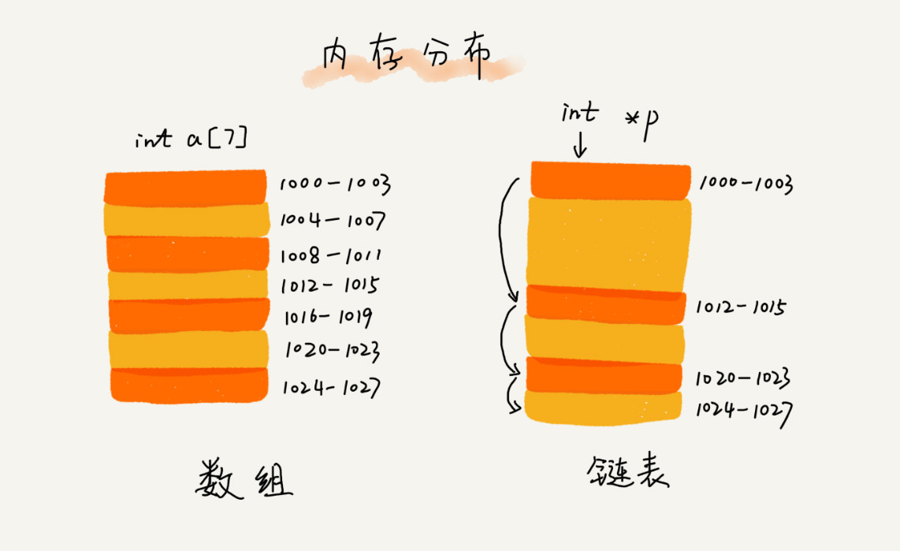
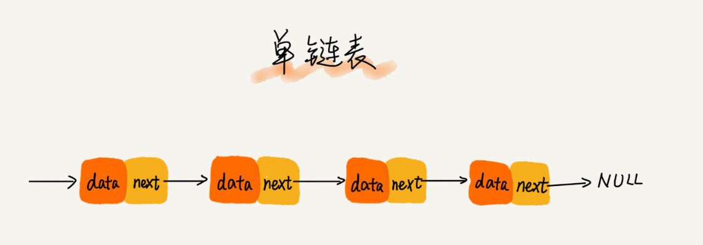

# 链表

## 存储结构

## 单链表

* 对比数组:

  进行数组的插入、删除操作时，为了保持内存数据的连续性，需要做大量的数据搬移，所以时间复杂度是 O(n)。  
  链表中插入或者删除一个数据，不需要为了保持内存的连续性而搬移结点，因为链表的存储空间本身就不是连续的,时间复杂度是 O(1)。  
  随机访问元素时，数组可以直接通过首地址和下标获取元素，时间复杂度为O(1)。  
  而链表需要依次遍历节点，才能找到相应的节点,时间复杂度为O(n)。  

## 循环链表

> 循环链表是一种特殊的单链表,单链表的尾结点指针指向空地址，表示这就是最后的结点了。而循环链表的尾结点指针是指向链表的头结点。

[约瑟夫环问题](./经典算法/Josephus.md)

## 双向链表

* 特点：
  * 需要额外的两个空间来存储后继结点和前驱结点的地址。
  * 支持双向遍历

### 对比单链表

* 场景1：删除结点中“值等于某个给定值”的结点

  对于单链表，双向链表都需要遍历取得“值等于某个给定值”的结点时间复杂度为O(n)

* 场景2：删除给定指针指向的结点。

  在知道需要删除节点的地址时，双线链表直接删除，前后驱节点响应指向变动就可以  。时间复杂度为O(1)
  对于单链表，为了知道给定节点的前驱结点，还需要从头遍历链表。时间复杂度为O(n)

* 场景3：同理   插入操作也是如此，双向链表更方便

* 场景4： 有序链表查询

  双向链表效率更高，可以记录上次查找的位置 p，每次查询时，根据要查找的值与 p 的大小关系，决定是往前还是往后查找，所以平均只需要查找一半的数据。

### 双向链表设计哲学 `空间换时间思想`

当内存空间充足的时候，追求代码的执行速度，我们就可以选择空间复杂度相对较高、但时间复杂度相对很低的算法或者数据结构。相反，如果内存比较紧缺，比如代码跑在手机或者单片机上，就要反过来用时间换空间的设计思路。

## 双向循环链表

## 链表对比数组

数组简单易用，在实现上使用的是连续的内存空间，可以借助 CPU 的缓存机制，预读数组中的数据，所以访问效率更高。  

而链表在内存中并不是连续存储，所以对 CPU 缓存不友好，没办法有效预读。

数组的缺点是大小固定，空间连续，若没有足够连续内存空间。将导致 内存不足

链表本身没有大小的限制，天然地支持动态扩容

链表内存消耗翻倍，对链表频繁插入删除操作，会导致频繁的内存申请释放，容易造成内存碎片

## LRU（Least recently used，最近最少使用） 缓存淘汰算法

* 思路：一链表 越接近尾部，越久之前访问过。

  1. 当有一个新数据访问时，从头遍历链表，如果该元素已存在，将原来的位置删除，并将其放到表头

  2. 如果没在缓存链表中

      * 此时缓存未满，如果此时缓存未满，则将此结点直接插入到链表的头部；
  
      * 如果此时缓存已满，则链表尾结点删除，将新的数据结点插入链表的头部。

## 思考题

* 判断一个字符串是否为回文子串

[题解](https://github.com/zooombies/once-a-day/blob/master/leetcode-go/is_palindrome_test.go)

* 单链表反转

* 链表中环的检测

* 两个有序的链表合并

* 删除链表倒数第 n 个结点

* 求链表的中间结点

## 链表代码技巧

1. 理解指针或引用的含义：将某个变量赋值给指针，实际上就是将这个变量的地址赋值给指针，或者反过来说，指针中存储了这个变量的内存地址，指向了这个变量，通过指针就能找到这个变量。

2. 警惕指针丢失和内存泄漏 插入结点时，一定要注意操作的顺序，要先将结点 x 的 next 指针指向结点 b，再把结点 a 的 next 指针指向结点 x，这样才不会丢失指针，导致内存泄漏。

删除链表结点时，也一定要记得手动释放内存空间

3. 利用哨兵简化实现难度

4. 重点留意边界条件处理

5. 举例画图，辅助思考
