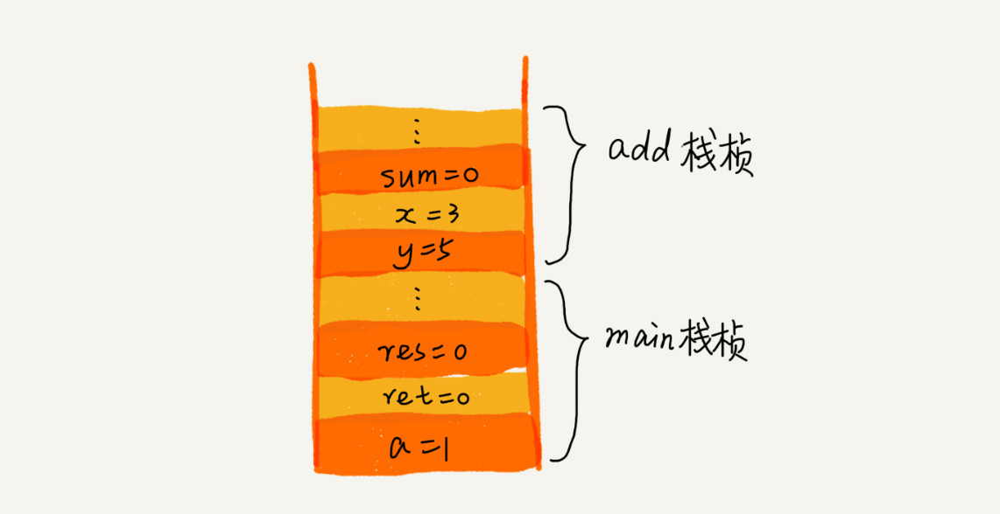

# 栈

后进者先出，先进者后出
栈是一种“操作受限”的线性表

当某个数据集合只涉及在一端插入和删除数据，并且满足后进先出、先进后出的特性，首选“栈”这种数据结构。

## 栈的实现

栈既可以用数组来实现，也可以用链表来实现。用数组实现的栈，我们叫作顺序栈，用链表实现的栈，我们叫作链式栈。

* 不管是顺序栈还是链式栈，存储数据只需要一个大小为 n 的数组就够了。在入栈和出栈过程中，只需要一两个临时变量存储空间，所以空间复杂度是 O(1)。
* 不管是顺序栈还是链式栈，入栈、出栈只涉及栈顶个别数据的操作，所以时间复杂度都是 O(1)。

## 栈的应用场景

### 函数调用栈

```c++
int main() {
   int a = 1;
   int ret = 0;
   int res = 0;
   ret = add(3, 5);
   res = a + ret;
   printf("%d", res);
   reuturn 0;
}

int add(int x, int y) {
   int sum = 0;
   sum = x + y;
   return sum;
}
```

main() 函数调用了 add() 函数，获取计算结果，并且与临时变量 a 相加，最后打印 res 的值。

函数调用栈情况如下：



操作系统给每个线程分配了一块独立的内存空间，这块内存被组织成“栈”这种结构, 用来存储函数调用时的临时变量。每进入一个函数，就会将临时变量作为一个栈帧入栈，当被调用函数执行完成，返回之后，将这个函数对应的栈帧出栈。

### 表达式求值

例：四则运算 3+5*8-6

编译器通过两个栈来实现的。其中一个保存操作数的栈，另一个是保存运算符的栈。

从左向右遍历表达式，当遇到数字，压入操作数栈；当遇到运算符，就与运算符栈的栈顶元素进行比较。如果比运算符栈顶元素的优先级高，就将当前运算符压入栈；如果比运算符栈顶元素的优先级低或者相同，从运算符栈中取栈顶运算符，从操作数栈的栈顶取 2 个操作数，然后进行计算，再把计算完的结果压入操作数栈，继续比较。


### 括号匹配

假设表达式中只包含三种括号，圆括号 `()`、方括号`[]`和花括号`{}`，并且它们可以任意嵌套。比如，`{[] ()[{}]}`或`[{()}([])]`等都为合法格式，而`{[}()]`或`[({)]`为不合法的格式。

用栈来保存未匹配的左括号，从左到右依次扫描字符串。当扫描到左括号时，则将其压入栈中；当扫描到右括号时，从栈顶取出一个左括号。如果能够匹配，比如`(`跟`)`匹配，`[`跟`]`匹配，`{`跟`}`匹配，则继续扫描剩下的字符串。如果扫描的过程中，遇到不能配对的右括号，或者栈中没有数据，则说明为非法格式。

当所有的括号都扫描完成之后，如果栈为空，则说明字符串为合法格式；否则，说明有未匹配的左括号，为非法格式。

### 浏览器的前进后退

使用两个栈，X 和 Y，把首次浏览的页面依次压入栈 X，当点击后退按钮时，再依次从栈 X 中出栈，并将出栈的数据依次放入栈 Y。
当点击前进按钮时，我们依次从栈 Y 中取出数据，放入栈 X 中。当栈 X 中没有数据时，那就说明没有页面可以继续后退浏览了。当栈 Y 中没有数据，那就说明没有页面可以点击前进按钮浏览了。

## 思考

* 我们在讲栈的应用时，讲到用函数调用栈来保存临时变量，为什么函数调用要用“栈”来保存临时变量呢？用其他数据结构不行吗？

    从调用函数进入被调用函数，对于数据来说，变化的是作用域。所以根本上，只要能保证每进入一个新的函数，都是一个新的作用域就可以。而要实现这个，用栈就非常方便。在进入被调用函数的时候，分配一段栈空间给这个函数的变量，在函数结束的时候，将栈顶复位，正好回到调用函数的作用域内。

* 我们都知道，JVM 内存管理中有个“堆栈”的概念。栈内存用来存储局部变量和方法调用，堆内存用来存储 Java 中的对象。那 JVM 里面的“栈”跟我们这里说的“栈”是不是一回事呢？如果不是，那它为什么又叫作“栈”呢？

    内存中的堆栈和数据结构堆栈不是一个概念，可以说内存中的堆栈是真实存在的物理区，数据结构中的堆栈是抽象的数据存储结构。

    内存空间在逻辑上分为三部分：`代码区`、`静态数据区`和`动态数据区`，动态数据区又分为`栈区`和`堆区`。

  * 代码区：存储方法体的二进制代码。高级调度（作业调度）、中级调度（内存调度）、低级调度（进程调度）控制代码区执行代码的切换。
  * 静态数据区：存储全局变量、静态变量、常量，常量包括final修饰的常量和String常量。系统自动分配和回收。
  * 栈区：存储运行方法的形参、局部变量、返回值。由系统自动分配和回收。
  * 堆区：new一个对象的引用或地址存储在栈区，指向该对象存储在堆区中的真实数据。

> leetcode : 20,155,232,844,224,682,496
