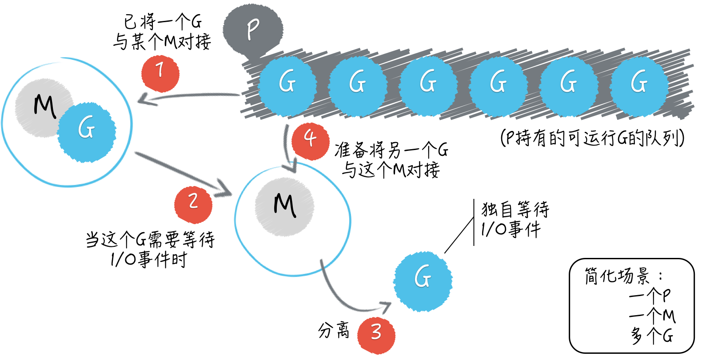

#

## 进程与线程

### 进程(process)

> 进程: 是一个具有独立功能的程序关于某个数据集合的一次运行活动。它是操作系统动态执行的基本单元，在传统的操作系统中,进程即是基本的分配单元，也是基本的执行单元。

#### 特征

1. 每个进程都有自己的地址空间，一般情况下，包含文本区域、数据区域、堆栈
1. 进程是执行中的程序，程序是一个没有生命的实体，只有处理器赋予程序生命时，它才能成为一个活动的实体，我们称之为进程
1. 进程本身不会运行，是线程的容器。线程不能单独执行，必须组成进程
1. 一个程序至少有一个进程，一个进程至少有一个线程
1. 对于操作系统来讲，一个任务就是一个进程，比如开一个浏览器就是启动一个浏览器进程。打开一款app就是打开一个进程。
1. 有些进程还不止同时做一件事情。比如APP内同时进行看视频并且回复用户评论，在一个进程内部，要同时干多件事情。

#### 进程状态(三态模型)

* 就绪：获取出CPU外的所有资源、只要处理器分配资源就可以马上执行
* 运行：获得处理器分配的资源，程序开始执行
* 阻塞：当程序条件不够的时候，需要等待提交满足的时候才能执行。

#### 进程状态(五态模型)

* 创建状态：进程在创建时需要申请一个空白PCB，向其中填写控制和管理进程的信息，完成资源分配。如果创建工作无法完成，比如资源无法满足，就无法被调度运行，把此时进程所处状态称为创建状态
* 就绪状态：进程已经准备好，已分配到所需资源，只要分配到CPU就能够立即运行
* 执行状态：进程处于就绪状态被调度后，进程进入执行状态
* 阻塞状态：正在执行的进程由于某些事件（I/O请求，申请缓存区失败）而暂时无法运行，进程受到阻塞。在满足请求时进入就绪状态等待系统调用
* 终止状态：进程结束，或出现错误，或被系统终止，进入终止状态。无法再执行

### 线程(thread)

> 线程:是操作系统能够进行运算调度的最小单位。它被包含在进程之中，是进程中的实际运作单位。

#### 线程状态

* 就绪：指线程具备运行的所有条件，逻辑上可以运行，在等待处理机
* 运行：指线程占用处理机正在运行
* 阻塞：线程在等待一个事件，逻辑上不可执行

### 协程

> 协程是一种用户态的轻量级线程，协程的`调度完全由用户控制`(进程和线程都是由cpu 内核进行调度)。协程拥有自己的寄存器上下文和栈。协程调度切换时，将寄存器上下文和栈保存到其他地方，在切回来的时候，恢复先前保存的寄存器上下文和栈，直接操作栈则基本没有内核切换的开销，可以不加锁的访问全局变量，所以上下文的切换非常快。

### 对比

* 对于 进程、线程，都是有内核进行调度，有 CPU 时间片的概念，进行 抢占式调度（有多种调度算法）
* 对于 协程(用户级线程)，这是对内核透明的，也就是系统并不知道有协程的存在，是完全由用户自己的程序进行调度的，因为是由用户程序自己控制，那么就很难像抢占式调度那样做到强制的 CPU 控制权切换到其他进程/线程，通常只能进行 协作式调度，需要协程自己主动把控制权转让出去之后，其他协程才能被执行到。

|比较的点|线程|协程|
|--|--|--|
|数据存储|内核态的内存空间|一般是线程提供的用户态内存空间|
|切换操作|操作最终在内核层完成，应用层需要调用内核层提供的syscall 底层函数|应用层使用代码进行简单的现场保存和恢复即可|
|任务调度|由内核实现，抢占方式，依赖各种锁|由用户态的实现的具体调度器进行。例如 go 协程的调度器|
|语音支持程度|绝大部分编程语言|部分语言：Lua，Go，Python ...|
|实现规范|按照现代操作系统规范实现|无统一规范。在应用层由开发者实现，高度自定义，比如只支持单线程的线程。不同的调度策略，等等|
|||

## goroutine(用户级线程)

> Go 语言不但有着独特的并发编程模型，以及用户级线程 goroutine，还拥有强大的用于调度 goroutine、对接系统级线程的调度器。

这个调度器是Go语言运行时系统的重要组成部分，负责统筹调配Go并发编程模型中的三个主要元素，即：G(`goroutine 用户级线程`)、P(`processor G,M中介`)和M(`系统级线程 machine`)。

调度关系:



[示例代码](./code/goroutine/goroutine_test.go)

```go
package main

import "fmt"

func main() {
  for i := 0; i < 10; i++ {
    go func() {
      fmt.Println(i)
    }()
  }
}
```

主 goroutine 的go函数就是那个作为程序入口的main函数,
只要go语句本身执行完毕，Go 程序完全不会等待go函数的执行，它会立刻去执行后边的语句。这就是所谓的异步并发地执行。
一旦主 goroutine 中的代码（也就是main函数中的那些代码）执行完毕，当前的 Go 程序就会结束运行。
如此一来，如果在 Go 程序结束的那一刻，还有 goroutine 未得到运行机会，那么它们就真的没有运行机会了，它们中的代码也就不会被执行了。
