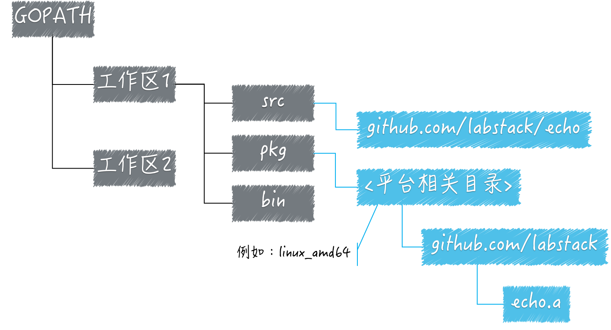

#

* [GO环境变量](#GO环境变量)
  * [GOPATH的意义](#GOPATH的意义)
    * [Go语言源码的组织方式](#1.Go语言源码的组织方式)
    * [源码安装后的结果](#2.源码安装后的结果)
    * [构建和安装Go程序的过程](#3.构建和安装Go程序的过程)
  * [扩展](#扩展)

---

## GO环境变量

* GOROOT：Go 语言安装根目录的路径，也就是 GO 语言的安装路径。
* GOPATH：若干工作区目录的路径。是我们自己定义的工作空间。
* GOBIN：GO 程序生成的可执行文件（executable file）的路径。

### GOPATH的意义

GOPATH:Go语言的`工作目录`，它的值是一个目录的路径，也可以是多个目录路径，每个目录都代表 Go 语言的一个工作区（workspace）。
利用这些工作区，去放置Go语言的`源码文件`（source file），以及安装（install）后的`归档文件`（archive file，也就是以“.a”为扩展名的文件）和`可执行文件`（executable file）。

由于 Go 语言项目在其生命周期内的所有操作（编码、依赖管理、构建、测试、安装等）基本上都是围绕着 GOPATH 和工作区进行的。所以，它涉及如下 3 个知识点：

#### 1.Go语言源码的组织方式

> go语言的源码以代码包为基础组织单位

* 在文件目录中这些代码包与目录一一对应，目录可以有子目录，包也可以有子包
* 一个代码包中可以包含任意个以.go 为扩展名的源码文件，这些源码文件都需要被声明属于同一个代码包。
* 代码包的名称一般会与源码文件所在的目录同名。如果不同名，那么在构建、安装的过程中会以代码包名称为准。
* 每个代码包都会有导入路径。代码包的导入路径是其他代码在使用该包中的程序实体时，需要引入的路径。在实际使用程序实体之前，我们必须先导入其所在的代码包。体的方式就是import该代码包的导入路径。  
  例如：**`import "github.com/labstack/echo"`**(此代码包导入路径的另一个含义：该代码包的源码文件存在于GitHub上labstack组的代码仓库 echo中)
* 在工作区中，一个代码包的导入路径实际上就是从 src 子目录，到该包的实际存储位置的相对路径。
  
  所以说，Go 语言源码的组织方式就是以环境变量 GOPATH、工作区、src 目录和代码包为主线的。一般情况下，Go 语言的源码文件都需要被存放在环境变量 GOPATH 包含的某个工作区（目录）中的 src 目录下的某个代码包（目录）中。

#### 2.源码安装后的结果

* 源码文件安装后将产生归档文件（以".a"为扩展名的文件），并且将放入pkg子目录，如果产生了可执行文件，将会放进工作区的bin子目录
* 安装某个代码包产生的归档文件与包代码包名同名
* 比如，一个已存在的代码包的导入路径是`github.com/labstack/echo`，那么执行命令`go install github.com/labstack/echo`生成的归档文件的相对目录就是 `github.com/labstack`， 文件名为 `echo.a`
* 归档文件的相对目录与 pkg 目录之间还有一级目录，叫做平台相关目录。平台相关目录的名称是由 build（也称“构建”）的目标操作系统、下划线和目标计算架构的代号组成的。比如，构建某个代码包时的目标操作系统是 Linux，目标计算架构是 64 位的，那么对应的平台相关目录就是 linux_amd64。因此，上述代码包的归档文件就会被放置在当前工作区的子目录 `pkg/linux_amd64/github.com/labstack` 中。  

#### 3.构建和安装Go程序的过程

> 构建使用命令go build，安装使用命令go install; 构建和安装代码包的时候都会执行编译、打包等操作，并且，这些操作生成的任何文件都会先被保存到某个临时的目录中。

构建

* 构建库源码文件，那么操作后产生的结果文件只会存在于临时目录中。这里的构建的主要意义在于检查和验证。
* 构建命令源码文件，那么操作的结果文件会被搬运到源码文件所在的目录中

安装

* 安装操作会先执行构建，然后还会进行链接操作，并且把结果文件搬运到指定目录。
* 安装库源码文件，那么结果文件会被搬运到它所在工作区的 pkg 目录下的某个子目录中。
* 安装命令源码文件，那么结果文件会被搬运到它所在工作区的 bin 目录中，或者环境变量GOBIN指向的目录中。

### 扩展

1. Go 语言在多个工作区中查找依赖包的时候是以怎样的顺序进行的？  
  GOPATH——>GOPATH从上到下的顺序。
2. 如果在多个工作区中都存在导入路径相同的代码包会产生冲突吗？
  不会，因为查找顺序是按从上到下先后顺序找的，先找到哪一个就用哪一个
