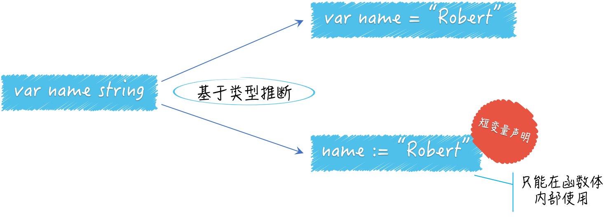

#

* [程序实体](#程序实体)
  * [声明变量的方式](#声明变量的方式)
  * [变量的重声明](#变量的重声明)
    * [注意事项](#注意事项)
  * [程序实体作域](#程序实体作域)
    * [代码块](#代码块)
    * [程序实体的查找过程](#程序实体的查找过程)
    * [扩展](#扩展)

## 程序实体

> Go 语言中的程序实体包括变量、常量、函数、结构体和接口。 Go 语言是静态类型的编程语言，所以我们在声明变量或常量的时候，都需要指定它们的类型，或者给予足够的信息，这样才可以让 Go 语言能够推导出它们的类型。

### 声明变量的方式



> 我们通常把不改变某个程序与外界的任何交互方式和规则，而只改变其内部实现”的代码修改方式，叫做对该程序的`重构`。重构的对象可以是一行代码、一个函数、一个功能模块，甚至一个软件系统。`不显式地指定变量name的类型，使得它可以被赋予任何类型的值。也就是说，变量name的类型可以在其初始化时，由其他程序动态地确定`。

```Go
package main

import (
    "flag"
    "fmt"
)

func main() {
    var name = getTheFlag() // 随意改变getTheFlag函数的内部实现，及其返回结果的类型，而不用修改main函数中的任何代码。
    flag.Parse()
    fmt.Printf("Hello, %v!\n", *name)
}

func getTheFlag() *string {
    return flag.String("name", "everyone", "The greeting object.")
}
```

> Go 语言是静态类型的，所以一旦在初始化变量时确定了它的类型，之后就不可能再改变。这就避免了在后面维护程序时的一些问题。另外，这种类型的确定是在编译期完成的，因此不会对程序的运行效率产生任何影响。

### 变量的重声明

> 变量的重声明:对已经声明过的变量再次声明

#### 注意事项

1. 由于变量的类型在其初始化时就已经确定了，所以对它再次声明时赋予的类型必须与其原本的类型相同，否则会产生编译错误。
2. 变量的重声明只可能发生在某一个`代码块`中。如果与当前的变量重名的是外层代码块中的变量，那么就是另外一种含义了。
3. 变量的重声明只有在使用短变量声明时才会发生，否则也无法通过编译。如果要在此处声明全新的变量，那么就应该使用包含关键字var的声明语句，但是这时就不能与同一个代码块中的任何变量有重名了。
4. 被“声明并赋值”的变量必须是多个，并且其中至少有一个是新的变量。这时我们才可以说对其中的旧变量进行了重声明。

变量重声明中的变量一定是在某一个代码块内的。这里的“某一个代码块内”并不包含它的任何子代码块，否则就变成了“多个代码块之间”。

* 可重名变量指的正是在多个代码块之间由相同的标识符代表的变量。

* 变量重声明是对同一个变量的多次声明，这里的变量只有一个。而可重名变量中涉及的变量肯定是有多个的。

* 不论对变量重声明多少次，其类型必须始终一致，具体遵从它第一次被声明时给定的类型。可重名变量之间不存在类似的限制，它们的类型可以是任意的。

* 如果可重名变量所在的代码块之间，存在直接或间接的嵌套关系，那么它们之间一定会存在“屏蔽”的现象。但是这种现象绝对不会在变量重声明的场景下出现。


```Go
var err error
n, err := io.WriteString(os.Stdout, "Hello, everyone!\n")
```

使用短变量声明对新变量n和旧变量err进行了“声明并赋值”，这时也是对后者的重声明

### 程序实体作域

> `一个程序实体的作用域总是会被限制在某个代码块中，而这个作用域最大的用处，就是对程序实体的访问权限的控制`。对“高内聚，低耦合”这种程序设计思想的实践，恰恰可以从这里开始。

#### 代码块

代码块一般就是一个由花括号括起来的区域，里面可以包含表达式和语句。

Go 语言本身以及我们编写的代码共同形成了一个非常大的代码块，也叫`全域代码块`。`只要是公开的全局变量，都可以被任何代码所使用`。

相对小一些的代码块是代码包，一个代码包可以包含许多子代码包，所以这样的代码块也可以很大。

每个源码文件也都是一个代码块，每个函数也是一个代码块，每个if语句、for语句、switch语句和select语句都是一个代码块。甚至，switch或select语句中的case子句也都是独立的代码块。走个极端，就在main函数中写一对紧挨着的花括号也算代码块，这甚至还有个名词，叫“空代码块”。

如果一个变量与其外层代码块中的变量重名会出现什么状况？

[示例](./code/scope/scope_test.go)

```go
package scope

import (
    "fmt"
    "testing"
)

var block = "package"

// 程序实体作用域
func TestScope(t *testing.T) {

    block := "function"
    {
        block := "inner"
        fmt.Printf("The block is %s.\n", block)
    }
    fmt.Printf("The block is %s.\n", block)
}
```

这个命令源码文件中有四个代码块，它们是：全域代码块,scope包代表的代码块,TestScope 函数代表的代码块,以及在 TestScope 函数中的一个用花括号包起来的代码块。

#### 程序实体的查找过程

1. 查找过程不只针对于变量，还适用于任何程序实体。如下面所示。

    首先，代码引用变量的时候总会最优先查找`当前代码块`中的那个变量。注意，这里的“当前代码块”仅仅是引用变量的代码所在的那个代码块，并不包含任何子代码块。  
    其次，如果当前代码块中没有声明以此为名的变量，那么程序会`沿着代码块的嵌套关系`，从直接包含当前代码块的那个代码块开始，一层一层地查找。一般情况下，程序会  一直  查到当前代码包代表的代码块。  
    如果仍然找不到，那么 Go 语言的编译器就会报错了。

1. 如果在当前源码文件中导入了其他代码包，那么引用其中的程序实体时，是需要以限定符为前缀的。所以程序在找代表变量未加限定符的名字（即标识符）的时候，是不会去被导入的代码包中查找的。

    但有个特殊情况，如果把代码包导入语句写成import . "XXX"的形式（注意中间的那个“.”），那么就会让这个“XXX”包中公开的程序实体，被当前源码文件中的代码，视为当前代码包中的程序实体。 比如，如果有代码包导入语句import . fmt，那么我们在当前源码文件中引用fmt.Printf函数的时候直接用Printf就可以了。在这个特殊情况下，程序在查找当前源码文件后会先去查用这种方式导入的那些代码包。

#### 扩展

1. 如果通过这种方式导入的代码包中的变量与当前代码包中的变量重名了，那么 Go 语言是会把它们当做“可重名变量”看待还是会报错呢？

    如果都是全局的变量，会报重复声明，如果只是在函数体重声明，作用域不一样，则不会
