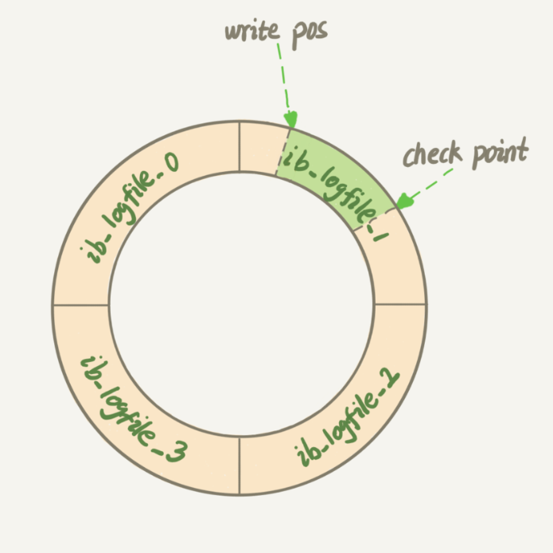

#

## MySQL查询过程


## 数据库连接方式

1. 长连接：连接成功后，如果客户端持续有请求，则一直使用同一个连接
1. 短连接：每次执行完很少的几次查询就断开连接，下次查询再重新建立一个

* 注
  * 因为连接过程比较复杂，所以推荐长连接
  * 使用长连接时，MySQL在执行过程中临时的内存是管理在连接对象里面的。这些资源会在连接断开的时候才释放。所以如果长连接累积下来，可能导致内存占用太大，被系统强行杀掉(OOM)，从现象看就是 MySQL 异常重启了。
  * 定期断开长连接 或者 MySQL5.7 之后可使用mysql_reset_connection来重新初始化连接资源(此过程不会重新连接和新做权限验证，会将连接恢复到刚刚创建完时的状态)

## 两个日志模块

1. redo log模块

    > 在 MySQL 里，如果每一次的更新操作都需要写进磁盘，然后磁盘要找到对应的那条记录，然后再更新，整个过程 IO 成本、查找成本很高。所以此处用到了 `WAL(Write-Ahead Logging)` 技术，它的关键点就是先写日志，再写磁盘

    当有一条记录需要更新的时候，InnoDB 引擎就会先把记录写到 redo log 里面，并更新内存，这个时候更新就算完成了。同时，InnoDB 引擎会在适当的时候，将这个操作记录更新到磁盘里面，而这个更新往往是在系统比较空闲的时候做。

    InnoDB 的 redo log 是固定大小的，比如可以配置为一组 4 个文件，每个文件的大小是 1GB，总共就可以记录 4GB 的操作。从头开始写，写到末尾就又回到开头循环写，如下面这个图所示。

    

    write pos 是当前记录的位置，一边写一边后移，写到第 3 号文件末尾后就回到 0 号文件开头。

    checkpoint 是当前要擦除的位置，也是往后推移并且循环的，擦除记录前要把记录更新到数据文件。

    write pos 和 checkpoint 之间还空着的部分，可以用来记录新的操作。如果 write pos 追上 checkpoint，这时候不能再执行新的更新，得停下来先擦掉一些记录，把 checkpoint 推进一下。有了 redo log，InnoDB 就可以保证即使数据库发生异常重启，之前提交的记录都不会丢失，这个能力称为 `crash-safe`。

1. binlog 模块

  > MySQL 整体来看，其实就有两块：一块是 Server 层，它主要做的是 MySQL 功能层面的事情；还有一块是引擎层，负责存储相关的具体事宜。 redo log 是 InnoDB 引擎特有的日志，而 Server 层也有自己的日志，称为 binlog(归档日志)。

* 为何会有两个日志模块

  因为最开始 MySQL 里并没有 InnoDB 引擎。MySQL 自带的引擎是 MyISAM，但是 MyISAM 没有 crash-safe 的能力，binlog 日志只能用于归档。而 InnoDB 是另一个公司以插件形式引入 MySQL 的，既然只依靠 binlog 是没有 crash-safe 能力的，所以 InnoDB 使用另外一套日志系统——也就是 redo log 来实现 crash-safe 能力。

### 两日志模块的不同点

1. redo log 是 InnoDB 引擎特有的；binlog 是 MySQL 的 Server 层实现的，所有引擎都可以使用。

1. redo log 是物理日志，记录的是`在某个数据页上做了什么修改`；binlog 是逻辑日志，记录的是这个语句的原始逻辑，比如"给 ID=2 这一行的c字段加1"。

1. redo log 是循环写的，空间固定会用完；binlog 是可以追加写入的。“追加写”是指 binlog 文件写到一定大小后会切换到下一个，并不会覆盖以前的日志。

* 示例

```sql
update T set c=c+1 where ID=2;
```

更新语句执行过程：

1. 执行器先找引擎取 ID=2 这一行。ID 是主键，引擎直接用树搜索找到这一行。如果 ID=2 这一行所在的数据页本来就在内存中，就直接返回给执行器；否则，需要先从磁盘读入内存，然后再返回。
2. 执行器拿到引擎给的行数据，把这个值加上 1，比如原来是 N，现在就是 N+1，得到新的一行数据，再调用引擎接口写入这行新数据。
3. 引擎将这行新数据更新到内存中，同时将这个更新操作记录到 redo log 里面，此时 redo log 处于 prepare 状态。然后告知执行器执行完成了，随时可以提交事务。
4. 执行器生成这个操作的 binlog，并把 binlog 写入磁盘。
5. 执行器调用引擎的提交事务接口，引擎把刚刚写入的 redo log 改成提交(commit)状态，更新完成。


将 redo log 的写入拆成了两个步骤：prepare 和 commit，这就是"两阶段提交"。两阶段提交是跨系统维持数据逻辑一致性时常用的一个方案

> redo log 用于保证 crash-safe 能力。innodb_flush_log_at_trx_commit 这个参数设置成 1 的时候，表示每次事务的 redo log 都直接持久化到磁盘。这个参数建议设置成 1，这样可以保证 MySQL 异常重启之后数据不丢失。sync_binlog 这个参数设置成 1 的时候，表示每次事务的 binlog 都持久化到磁盘。这个参数也建议设置成 1，这样可以保证 MySQL 异常重启之后 binlog 不丢失。

## 事务

> 事务特性ACID(Atomicity、Consistency、Isolation、Durability，即原子性、一致性、隔离性、持久性)

### 事务隔离级别

> 当数据库上有多个事务同时执行的时候，就可能出现脏读(dirty read)、不可重复读(non-repeatable read)、幻读(phantom read)的问题，为了解决这些问题，就有了“隔离级别”的概念。

隔离得越严实，效率就会越低。因此很多时候，我们都要在二者之间寻找一个平衡点。

SQL 标准的事务隔离级别包括：

* `读未提交`(read uncommitted):一个事务还没提交时，它做的变更就能被别的事务看到。
* `读提交`(read committed):一个事务提交之后，它做的变更才会被其他事务看到
* `可重复读`(repeatable read):一个事务执行过程中看到的数据，总是跟这个事务在启动时看到的数据是一致的。当然在可重复读隔离级别下，未提交变更对其他事务也是不可见的。
* `串行化`(serializable ):顾名思义是对于同一行记录，“写”会加“写锁”，“读”会加“读锁”。当出现读写锁冲突的时候，后访问的事务必须等前一个事务执行完成，才能继续执行。

示例： 假设数据表 T 中只有一列，其中一行的值为 1，下面是按照时间顺序执行两个事务的行为。

## 索引

* 索引常见模型
  * 哈希表：hash函数就是根据key计算出应该存储地址的位置，而哈希表是基于哈希函数建立的一种查找表
    * 地址index=H(key)
    * 哈希冲突 即H(key1) = H(key1)
    * 哈希表只适用于做等值查询(结构不是有序的，新增是往后追加)，不适用于范围查找，新增很快
  * 有序数组
    * 在等值查询和范围查询场景中的性能就都非常优秀(二分法)
    * 新增时很耗费资源(插入时，后面的数据需要依次递增)
    * 有序数组索引只适用于静态存储引擎
  * 搜索树
    * N叉树
  * 其他 跳表，LSM树 等
* InnoDB中使用B+树索引模型
  * 主键索引和普通索引的查询有什么区别？  
    `假设ID为主键 字段k 建立普通索引`  
    `如果语句是 select * from T where ID = 500 即主键查询方式 ，则只需要搜索 ID 这棵 B+ 树`  
    `如果语句是 select * from T where k=5，即普通索引查询方式，则需要先搜索 k 索引树，得到 ID 的值，再到 ID 索引树搜索一次。这个过程称为回表`  
    `也就是说，基于非主键索引的查询需要多扫描一棵索引树。因此，我们在应用中应该尽量使用主键查询。`
