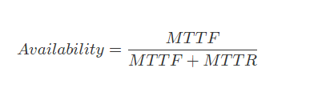

#

## 2019-12-23

### 弹力设计

`容错设计`又叫`弹力设计`，其中着眼于分布式系统的各种“容忍”能力，包括容错能力（服务隔离、异步调用、请求幂等性）、可伸缩性（有 / 无状态的服务）、一致性（补偿事务、重试）、应对大流量的能力（熔断、降级）。可以看到，在确保系统正确性的前提下，系统的可用性是弹力设计保障的重点。

对于分布式系统的容错设计，在英文中又叫 Resiliency（弹力）。意思是，系统在不健康、不顺，甚至出错的情况下有能力 hold 得住，挺得住，还有能在这种逆境下力挽狂澜的能力。

### 系统可用性

## 2019-12-24

### 隔离设计

隔离设计对应的单词是 `Bulkheads`,中文翻译为隔板。但其实，这个术语是用在造船上的，也就是船舱里防漏水的隔板。一般的船无论大小都会有这个东西，大一点的船都会把船舱隔成若干个空间。这样，如果船舱漏水，只会进到一个小空间里，不会让整个船舱都进水而导致整艘船都沉了。 在分布式软件架构中，我们使用类似的技术来让我们的故障得到隔离。这就需要我们对系统进行分离。一般来说，对于系统的分离有两种方式，一种是以服务的种类来做分离，一种是以用户来做分离。下面具体说明一下这两种方式。

### 按服务的种类来做分离

我们将系统分成多个板块。这每个板块分别使用不同的域名、服务器和数据库，做到从接入层到应用层再到数据层三层完全隔离。这样一来，在物理上来说，一个板块的故障就不会影响到另一板块。

### 按用户的请求来做分离

完全独立的设计。每个租户有自己完全独立的服务和数据。
独立的数据分区，共享的服务。多租户的服务是共享的，但数据是分开隔离的。
共享的服务，共享的数据分区。每个租户的数据和服务都是共享的。

## 2019-12-25

### 异步通讯设计

### 同步调用弊端

通讯一般来说分同步和异步两种。同步通讯就像打电话，需要实时响应，而异步通讯就像发邮件，不需要马上回复。
同步调用虽然让系统间只耦合于接口，而且实时性也会比异步调用要高，但是我们也需要知道同步调用会带来如下几个问题。
1. 同步调用需要被调用方的吞吐不低于调用方的吞吐。否则会导致被调用方因为性能不足而拖死调用方。换句话说，整个同步调用链的性能会由最慢的那个服务所决定。
2. 同步调用会导致调用方一直在等待被调用方完成，如果一层接一层地同步调用下去，所有的参与方会有相同的等待时间。这会非常消耗调用方的资源。因为调用方需要保存现场（Context）等待远端返回，所以对于并发比较高的场景来说，这样的等待可能会极度消耗资源。同步调用只能是一对一的，很难做到一对多。
3. 同步调用最不好的是，如果被调用方有问题，那么其调用方就会跟着出问题，于是会出现多米诺骨牌效应，故障一下就蔓延开来。

异步通讯相对于同步通讯来说，除了可以增加系统的吞吐量之外，最大的一个好处是其可以让服务间的`解耦`更为彻底，系统的调用方和被调用方可以按照自己的速率而不是步调一致，从而可以更好地保护系统，让系统更有弹力。

### 异步通讯的三种方式

1. 请求响应式
    两种方式：
    * 发送方不断轮询
    * 发送方注册一个回调方法，也就是接收方处理完后回调请求方,(比如微信支付)
2. 通过订阅的方式
    这种情况下，接收方（receiver）会来订阅发送方（sender）的消息，发送方会把相关的消息或数据放到接收方所订阅的队列中，而接收方会从队列中获取数据。
3. 通过 Broker 的方式
    所谓 Broker，就是一个中间人，发送方（sender）和接收方（receiver）都互相看不到对方，它们看得到的是一个 Broker，发送方向 Broker 发送消息，接收方向 Broker 订阅消息。
    
    
    这是完全的解耦。所有的服务都不需要相互依赖，而是依赖于一个中间件 Broker。这个 Broker 是一个像数据总线一样的东西，所有的服务要接收数据和发送数据都发到这个总线上，这个总线就像协议一样，让服务间的通讯变得标准和可控。