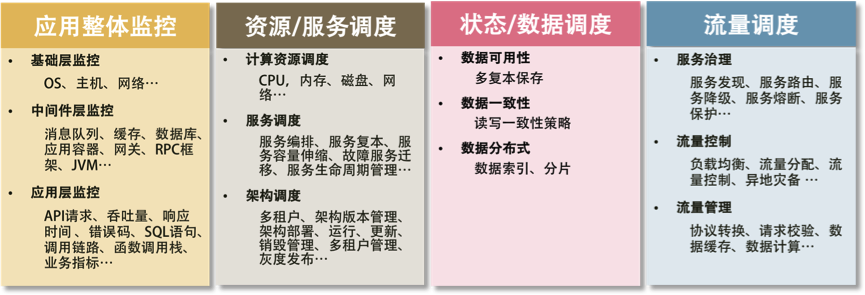

#

## 2019-12-16

### 使用分布式系统原因

1. 增大系统容量
1. 加强系统可用

### 单体应用和分布式架构对比

### 分布式系统存在问题

1. 架构设计变得复杂（尤其是其中的分布式事务）。
1. 部署单个服务会比较快，但是如果一次部署需要多个服务，流程会变得复杂。
1. 系统的吞吐量会变大，但是响应时间会变长。
1. 运维复杂度会因为服务变多而变得很复杂。
1. 架构复杂导致学习曲线变大。
1. 测试和查错的复杂度增大。
1. 技术多元化，这会带来维护和运维的复杂度。
1. 管理分布式系统中的服务和调度变得困难和复杂。

### SOA——基于服务的架构

### 分布式系统中需要注意的问题

1. 异构系统的不标准问题
1. 系统架构中的服务依赖性问题
1. 故障发生的概率更大
1. 多层架构的运维复杂度更大

>分工不是问题，问题是分工后的协作是否统一和规范。

## 2019-12-17

### 分布式系统技术实现

1. `大流量处理`。通过集群技术把大规模并发请求的负载分散到不同的机器上。
1. `关键业务保护`。提高后台服务的可用性，把故障隔离起来阻止多米诺骨牌效应（雪崩效应）。如果流量过大，需要对业务降级，以保护关键业务流转。

### 提高性能常用技术

1. `缓存系统`。加入缓存系统，可以有效地提高系统的访问能力。从前端的浏览器，到网络，再到后端的服务，底层的数据库、文件系统、硬盘和 CPU，全都有缓存，这是提高快速访问能力最有效的手段。对于分布式系统下的缓存系统，需要的是一个缓存集群。这其中需要一个 Proxy 来做缓存的分片和路由。
1. `负载均衡系统`。负载均衡系统是水平扩展的关键技术，它可以使用多台机器来共同分担一部分流量请求。
1. `异步调用`。异步系统主要通过消息队列来对请求做排队处理，这样可以把前端的请求的峰值给“削平”了，而后端通过自己能够处理的速度来处理请求。这样可以增加系统的吞吐量，但是实时性就差很多了。同时，还会引入消息丢失的问题，所以要对消息做持久化，这会造成“有状态”的结点，从而增加了服务调度的难度。
1. `数据分区`和`数据镜像`。数据分区是把数据按一定的方式分成多个区（比如通过地理位置），不同的数据区来分担不同区的流量。这需要一个数据路由的中间件，会导致跨库的 Join 和跨库的事务非常复杂。而数据镜像是把一个数据库镜像成多份一样的数据，这样就不需要数据路由的中间件了。你可以在任意结点上进行读写，内部会自行同步数据。然而，数据镜像中最大的问题就是数据的一致性问题。

### 提高稳定性常用技术

1. `服务拆分`。服务拆分主要有两个目的：一是为了隔离故障，二是为了重用服务模块。但服务拆分完之后，会引入服务调用间的依赖问题。
1. `服务冗余`。服务冗余是为了去除单点故障，并可以支持服务的弹性伸缩，以及故障迁移。然而，对于一些有状态的服务来说，冗余这些有状态的服务带来了更高的复杂性。其中一个是弹性伸缩时，需要考虑数据的复制或是重新分片，迁移的时候还要迁移数据到其它机器上。
1. `限流降级`。当系统实在扛不住压力时，只能通过限流或者功能降级的方式来停掉一部分服务，或是拒绝一部分用户，以确保整个架构不会挂掉。这些技术属于保护措施。
1. `高可用架构`。通常来说高可用架构是从冗余架构的角度来保障可用性。比如，多租户隔离，灾备多活，或是数据可以在其中复制保持一致性的集群。总之，就是为了不出单点故障。
1. `高可用运维`。高可用运维指的是 DevOps 中的 CI/CD（持续集成 / 持续部署）。一个良好的运维应该是一条很流畅的软件发布管线，其中做了足够的自动化测试，还可以做相应的灰度发布，以及对线上系统的自动化控制。这样，可以做到“计划内”或是“非计划内”的宕机事件的时长最短。

### 分布式系统的关键技术

引入分布式系统，会引入一堆技术问题，需要从以下几个方面来解决。

`服务治理`。服务拆分、服务调用、服务发现、服务依赖、服务的关键度定义……服务治理的最大意义是需要把服务间的依赖关系、服务调用链，以及关键的服务给梳理出来，并对这些服务进行性能和可用性方面的管理。
`架构软件管理`。服务之间有依赖，而且有兼容性问题，所以，整体服务所形成的架构需要有架构版本管理、整体架构的生命周期管理，以及对服务的编排、聚合、事务处理等服务调度功能。
`DevOps`。分布式系统可以更为快速地更新服务，但是对于服务的测试和部署都会是挑战。所以，还需要 DevOps 的全流程，其中包括环境构建、持续集成、持续部署等。
`自动化运维`。有了 DevOps 后，我们就可以对服务进行自动伸缩、故障迁移、配置管理、状态管理等一系列的自动化运维技术了。
`资源调度管理`。应用层的自动化运维需要基础层的调度支持，也就是云计算 IaaS 层的计算、存储、网络等资源调度、隔离和管理。
`整体架构监控`。如果没有一个好的监控系统，那么自动化运维和资源调度管理只可能成为一个泡影，因为监控系统是你的眼睛。没有眼睛，没有数据，就无法进行高效的运维。所以说，监控是非常重要的部分。这里的监控需要对三层系统（应用层、中间件层、基础层）进行监控。
`流量控制`。最后是我们的流量控制，负载均衡、服务路由、熔断、降级、限流等和流量相关的调度都会在这里，包括灰度发布之类的功能也在这里。

### 分布式系统的“纲”

分布式系统有五个关键技术，它们是：`全栈系统监控`；`服务 / 资源调度`；`流量调度`；`状态 / 数据调度`；`开发和运维的自动化`。

