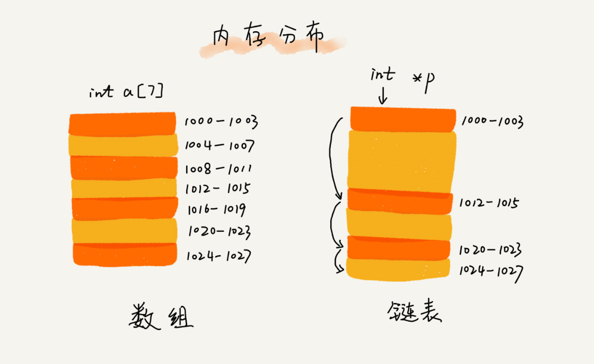
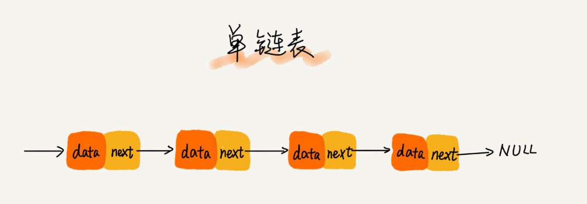

# 链表

## 存储结构

## 单链表

* 对比数组:

  进行数组的插入、删除操作时，为了保持内存数据的连续性，需要做大量的数据搬移，所以时间复杂度是 O(n)。  
  链表中插入或者删除一个数据，不需要为了保持内存的连续性而搬移结点，因为链表的存储空间本身就不是连续的,时间复杂度是 O(1)。  
  随机访问元素时，数组可以直接通过首地址和下标获取元素，时间复杂度为O(1)。  
  而链表需要依次遍历节点，才能找到相应的节点,时间复杂度为O(n)。  

## 循环链表

> 循环链表是一种特殊的单链表,单链表的尾结点指针指向空地址，表示这就是最后的结点了。而循环链表的尾结点指针是指向链表的头结点。

[约瑟夫环问题](./经典算法/Josephus.md)

双向链表

LRU 缓存淘汰算法
