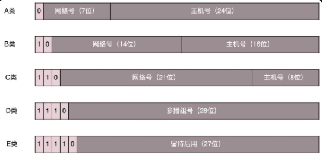
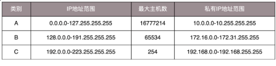

# IP

>IP 地址是一个网卡在网络世界的通讯地址，相当于我们现实世界的门牌号码。

IPv4 32位 分为5类



不同类别对应地址范围



## 无类型域间选路（CIDR)

打破分类规则

* 例1:10.100.122.2/24，这个 IP 地址中有一个斜杠，斜杠后面有个数字 24。这种地址表示形式，就是 CIDR。后面 24 的意思是，32 位中，前 24 位是网络号，后 8 位是主机号。

* 例2：

```.
IP地址:203.123.1.135/26     11001011.01111011.00000001.10000111
子网掩码:255.255.255.192     11111111.11111111.11111111.11000000

IP地址:16.158.165.91/22    00001000.10111000.10100101.01011011
IP首地址:16.158.164.1        00001000.10111000.10100100.00000001
子网掩码:255.255.252.0       11111111.11111111.11111100.00000000
```
